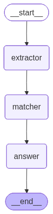
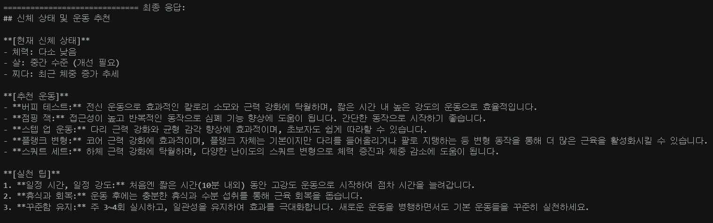

# LangGraph Multi-Agent Exercise Recommender

LangGraph를 활용한 멀티 에이전트 운동 추천 시스템입니다.  
사용자의 건강 고민을 입력하면 3개의 에이전트가 순차적으로 처리하여 맞춤 운동을 추천합니다.

---

## 📌 그래프 구조



---

## 🤖 에이전트 역할

| 에이전트 | 역할 |
|---|---|
| `extractor` | 사용자 질문에서 신체 상태 / 건강 고민 키워드 추출 |
| `matcher` | 추출된 상태를 해결할 수 있는 운동 5가지 추천 |
| `answer` | 상태 + 운동 리스트를 개조식 포맷으로 최종 답변 생성 |

---

## 🛠 기술 스택

- **Python 3.10**
- **LangGraph** - 멀티 에이전트 상태 머신 구성
- **LangChain** - 프롬프트 템플릿 및 LLM 체인
- **LangChain Community** - Ollama LLM 연동
- **Ollama** (`exaone3.5:2.4b`) - 로컬 LLM 실행

---

## ⚙️ 설치 방법

```bash
pip install langchain langgraph langchain-community chromadb sqlite-utils
```

> Ollama가 로컬에 설치되어 있어야 합니다.  
> 모델 다운로드: `ollama pull exaone3.5:2.4b`

---

## 🚀 실행 방법

노트북 셀을 순서대로 실행한 뒤, 마지막 셀에서 입력창이 뜨면 고민을 입력하세요.

```
건강 고민을 입력하세요: 체력이 안좋고, 살이 계속 찌는데 어떤 운동을 할까?
```

### 출력 예시



---

## 📁 파일 구성

```
├── langgraph_exercise.ipynb   # 메인 노트북
├── images/
│   ├── graph.png              # LangGraph 구조 시각화
│   └── result.png             # 실행 결과 스크린샷
└── README.md
```
